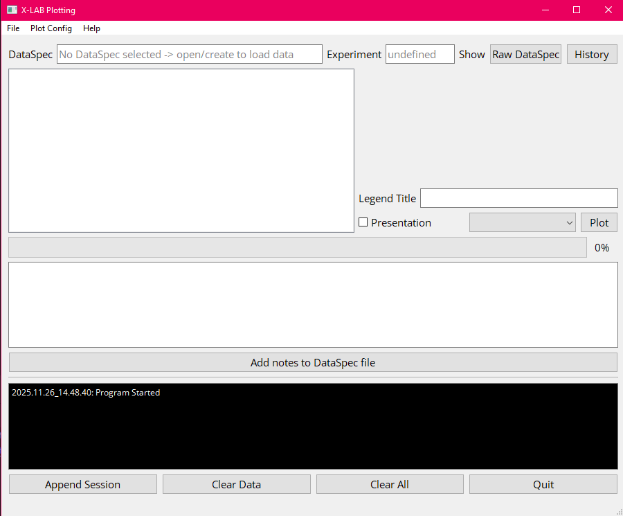
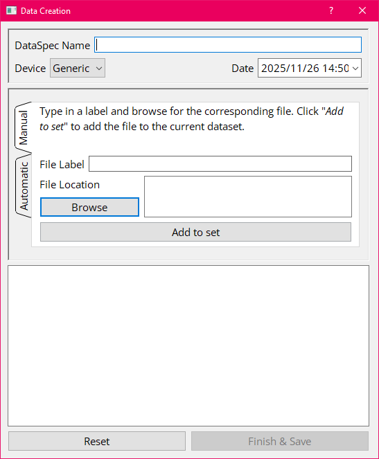

# X-LAB Plotting Manager


The **X-LAB Plotting Manager** is a PyQt-based desktop application for managing scientific data and generating publication-ready plots.  
It is designed around a clean separation between:

- **Core GUI + contracts** (this repository), and  
- **Device/experiment-specific implementations** (separate package you provide)

---

## ✨ Features

- PyQt-based GUI for dataset management  
- “DataSets” describing required data & metadata  
- Modular architecture (devices, data types, processors, plotters) 
- Fully extensible/customisable via external implementation packages  
- Minimal MkDocs documentation

---

## 🚀 Quick Installation

### 1) Install Python

Ensure you have **Python 3.10+** installed:  
https://www.python.org/downloads/

---

### 2) Clone the project

```bash
git clone https://github.com/Allyson-Robert/X-LAB_Plotting_Manager.git
```

---

### 3) Set up a virtual environment and install dependencies

```bash
cd X-LAB_Plotting_Manager

python -m venv .venv
source .venv/bin/activate       # Windows: .venv\Scripts\activate

# Example for Python 3.12
pip install -r requirements-312.txt
```

---

### 4) Add an implementation package

The GUI **requires an implementation** of the device/data/processor/plotter contracts.  
You may:

- Provide **your own** implementation inside `implementations/`  
- Or clone the official example implementation:

```bash
git clone https://github.com/Allyson-Robert/X-LAB_Plotting_Manager_Implementations.git implementations/
pip install -r implementations/requirements-312.txt
```

Without an implementation, the application will exit with an error on startup.

> ✨ **Yes—you can write your own full implementation!**  
> The documentation explains how to implement devices, datasets, data classes, processors, and plotters.

---

### 5) Launch the GUI from the root directory (e.g. X-LAB_Plotting_Manager/)S

```bash
python -m gui.windows.MainWindow
```

This opens the main application window:



---

## 📦 Creating a Dataset

From the menu bar:

**File → Create Set**

This opens the **Data Creation Window**, where you build datasets based on structured **datasets** that define required data inputs and metadata.



---

## 🧩 Architecture Overview

The project architecture is modular and contract-driven:

- **Contracts** define what each component must implement  
- **Implementations** provide hardware-/experiment-specific functionality  
- **GUI** manages and orchestrates components


---

## 📚 Documentation

Full documentation is available in the `docs/` folder:

- Overview: [docs/index.md](docs/index.md)  
- Getting started: [docs/getting-started.md](docs/getting-started.md) 
- datasets: [docs/datasets.md](docs/datasets.md)

### View pre-built docs locally

```bash
python -m http.server -d site 8000
```

Then open:  
http://localhost:8000

---

## 🤝 Contributing

Contributions are welcome!

1. Fork the repository  
2. Create a feature branch  
3. Make your changes  
4. Submit a pull request  

Before contributing, please ensure:

- New features follow the contract-driven architecture
- New components include minimal documentation  
- GUI changes preserve cross-platform behavior  

---

## 📄 License

TBD

---

## Known Issues

For Python 3.10 the specific version of PyQt5 triggers a deprecation warning. This does not affect functionality and can be safely ignored.
