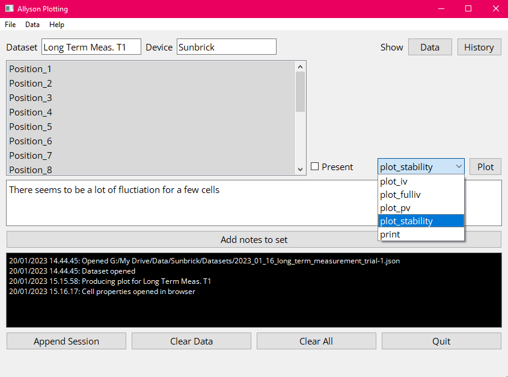
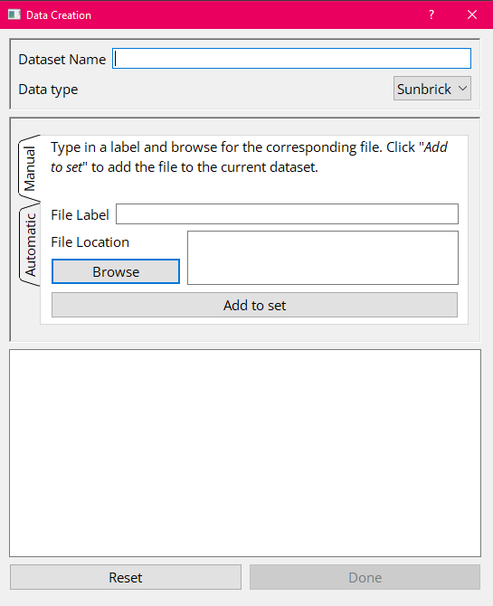
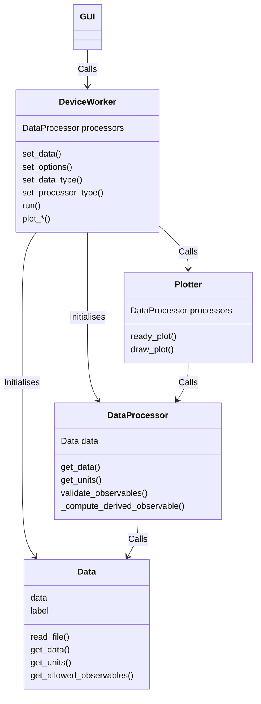
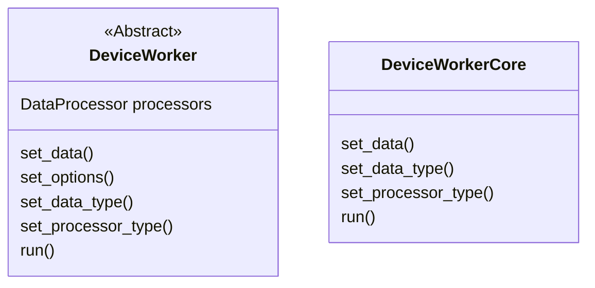
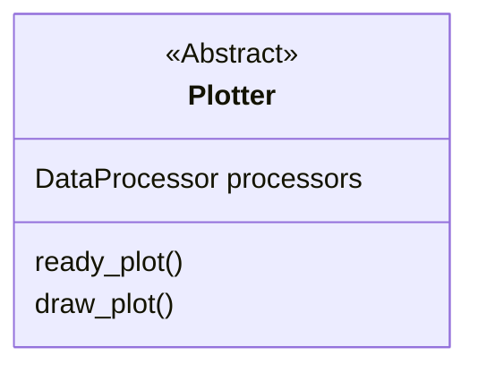
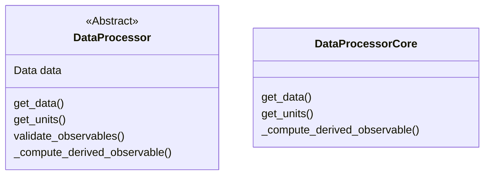
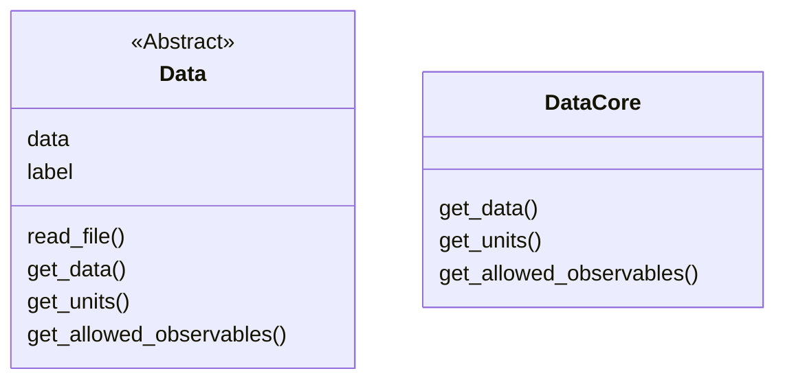

X-Lab Plotting v2.0.0
===========================
Last update: **2025/11/25**

Plotting software written while pursuing a PhD at Hasselt University. 
This program can be used to create filesets and plot the contents of the files therein.

### Table of Contents
* [Installation](#installation)
* [General Use](#general-use)
* [How to Expand](#how-to-expand)
* [Upcoming Features](#upcoming-features)


Installation
============

### 1. Clone the GUI repository

```bash
git clone https://github.com/Allyson-Robert/X-LAB_Plotting_Manager.git
cd X-LAB_Plotting_Manager
```

### 2. (Optional, recommended) Clone the Implementations repository

The GUI automatically loads various classes, such as devices, data processors, and plotters from the `implementations/` directory.
To use this plotting manager effectively you will want to implement your own version of all of these.
These should be implemented according to the contracts available in the *contracts* submodule.
It is therefore recommended to clone/fork the example implementation from [this](https://github.com/Allyson-Robert/X-LAB_Plotting_Manager_Implementations) repository.

```bash
git clone https://github.com/Allyson-Robert/X-LAB_Plotting_Manager_Implementations.git implementations
```

This keeps the GUI and implementations cleanly separated, allows users to version their implementation as desired.


### 3. Create a virtual environment

```bash
python -m venv .venv
# Activate:
source .venv/bin/activate        # Linux/macOS
.\.venv\Scripts\activate         # Windows
```

### 4. Install dependencies

```bash
pip install -r requirements.txt
```

If your implementations require additional packages, install them as well.

### 5. Launch the application

From the project root:

```bash
python -m gui.windows.MainWindow
```

The GUI will start and automatically detect any available implementations in the `implementations/` directory.

---

Dependencies
------------
| Data           | GUI            | Built-in |
|----------------|----------------|----------|
| Plotly v5.11.0 | PyQt5 v5.15.4  | datetime |
| Numpy v1.24.0  | natsort v8.2.0 | json     |
| Pandas v1.5.2  |                | csv      |
|                |                | sys      |
|                |                | os       |


General Use
===========
### Main window


### Menu bar
The menu bar contains three main submenus: *"File"*, *"Plot Config"*, and *"Help"*

#### File
Most important is the *"File"* dropdown which allows the use to create, save and load dataspecs.
These dataspecs are json files containing some metadata about any particular analysis session as well as paths
to the files used in that session.
They should be saved as *".ds"* or *".dataspec."*

#### Plot Config
The *"Plot Config"* is currently under construction and is not yet functional.

#### Help
The *"Help"* links to a basic about window and to this documentation (not yet implemented).

### DataSpec creation


DataSpecs are created by opening the Data Creation Window by navigating the menu bar *"File -> Create Set"*.
Filesets must always be named and contain paths to datafiles.
Do not forget to select the correct Experiment Type at this step.
Adding datafiles can be done manually by browsing to the proper file and labelling each.
It is also possible to generate a set of datafiles automatically by navigating to the *"Automatic"* tab and choosing a directory.
Each file is then added and labelled with its name.
By default, the Data Creation Window is opened on the *"Manual"* tab.

Filesets are saved after creation and by navigating *"File -> Save Set"*. 
Do not forget to append the *".json"* file extension to the name when saving.

These filesets can also be loaded again by navigating *"File -> Load Set"*.
Note that only the fileset itself is loaded in this step.
The contents of each data file references in this fileset will only be loaded when plotting.

### Experiment
The experiment type is selected when a fileset is created and will alter some UI elements to reflect the type of 
analysis required for the device.
Any number of new experiments can be defined and included as needed by subclassing DeviceWorker and adding it to the GUI.
See  for more information
A Generic Experiment is included by default as an example.

### Notes
A text window is available to add notes to a fileset if necessary.
Any important remarks or findings can in this way remain associated with the files containing the data.

### Console
The program is moderately verbose and will offer warnings, errors and other runtime messages through the console at the bottom of the screen.
It can be useful to add the contents of the console to the fileset in order to save a particularly interesting sequence of plots.
This way plots can be easily reproduced manually by reading the console output.

How to Expand
=============
The structure of the software loosely follows the schema below.
The GUI calls an DeviceWorker class and initialises it with the required plot type, options and fileset.
This worker is passed to a separate thread where it can perform computations without freezing the GUI which is then free
to display progress.

The DeviceWorker must be aware of the type of data and dataprocessor to be used to initialise them.
Once the data is set (i.e. the processors are initialised and the data has been read from the files) the 
DeviceWorker will call an appropriate plotter depending on the specific plot type.
This plotter requires the processors and will retrieve data from them.

Cores are available for: DeviceWorker, DataProcessor and Data.
These contain default implementation that do not need to know much about the internals of the Data to function.
These Cores can be subclassed for quick/common additions.
If more control is required then subclass the abstract base classes directly.



### DeviceWorker


### Plotter


### DataProcessor


### Data
